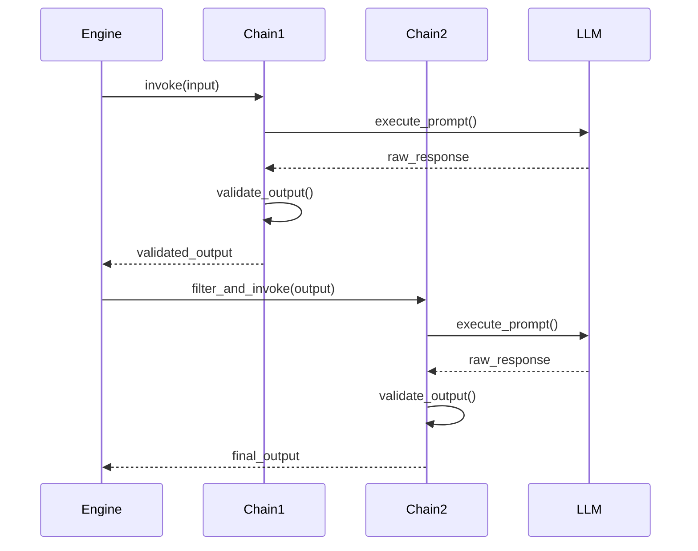
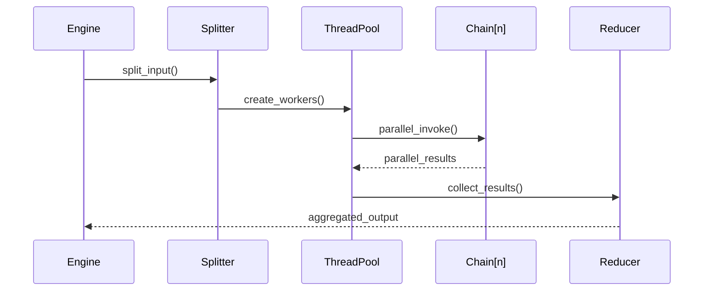

# ChainFactory: Run Structured LLM Inference with Easy Parallelism (`chainfactory-py 0.0.12`)

## Overview

`ChainFactory` is a utility that runs LLM chains by configuration instead of code. The config format is basically slightly modified `.yaml` which I am calling `.fctr` (too cheesy?). Here's how a 1-step chain looks like:

``` yaml
# file: examples/haiku_purpose.fctr
purpose: to generate haikus
def:
  Haiku:
    haiku: str
    explanation: str
    topic: str
in:
  num: int
  topic: str
out:
  haikus : list[Haiku] # structured output, types auto generated at runtime
```

**TLDR**: Here's what ChainFactory can do to simplify the handling of your LLM chains:

- **Auto-generation of prompts** using a purpose and stating the inputs.
- Effortless **flow of data between multi step chains**.
- **Automatic filtering and mapping** the **output** data from one chain **to the inputs** of the next chain.
- As of right now, ChainFactory is **the easiest way to get structured, and strictly typed outputs** from your LLM chains. (Let me know if you have come across any better solutions)
- **Parallel execution** is like second nature to ChainFactory as it was the **reason it was created for.**.
- **Seamless transitions** from **sequential** to **parallel** execution modes and vice versa.
- **Avoid** the need to use **vague prompting tricks and heurestics** and **writing paragraphs** of text to **convince the model** (beg) to do what you want.

The chains produced this way are reproducible and easy to manage i.e read, edit and share. They can be loaded and executed using the `ChainFactoryEngine` class which can be directly called like a function once instantiated. ~~Besides the engine, I also plan to eventually add transpilation to Python and JavaScript clients if it seems like a sensible direction.~~ That did not turn out to be a sensible direction.

**Note**: A very interesting pattern is possible here because of defining the chains via config: you can generate and execute use-case tailored chains with arbitrary number of steps, dynamically during runtime. The generator of these chains could itself be a chainfactory chain.

## Installation
Using `pip` or [https://python-poetry.org/](poetry) as follows:

   ```bash
   pip3 install chainfactory-py
   ```

   ```bash
   poetry add chainfactory-py
   ```

Make sure your OpenAI API key is set up in the environment variables:

   ```bash
   export OPENAI_API_KEY="sk-xxxxxxxxxxxxxxxxxxxxxxxxxxxxxxxxxxxxxxxx"
   ```

## The Roadmap & TODOs

- [x] implement defined reusable types
- [x] accept direct kwargs in engine call
- [x] implement bells and whistles for the prompt section
- [x] implement default values
- [x] implement field descriptions
- [x] syntax: serial execution using @chainlink /name/ sequential
- [x] basic documentation and walkthrough
- [x] syntax: parallel execution using @chainlink /name/ ||
  - [x] data piping and variable matching
  - [x] sequential to parallel handover (split)
  - [x] parallel execution in threadpool
  - [x] parallel to parallel handover (map)
  - [x] parallel to sequential handover (reduce)
- [x] optimizations such as hash based caching for internal generation of prompts
- [x] a lot of syntax tweaking (ongoing)
- [ ] implement enum types in defs and outs
- [ ] simple RAG and source propagation
- [ ] few shot prompting and via semantic selection
- [ ] streaming mode
- [ ] (a secret awesome thing still being cooked)

# ChainFactory Technical Specification & Execution Flow - v006
Spec Authors: Pankaj Garkoti &  Claude 3.5 Sonnet
Last Updated: 17 November 2024

## 1. System Architecture

### 1.1 Core Components

#### 1.1.1 ChainFactoryEngine
The primary execution runtime that orchestrates chain execution. Responsible for:
- Chain instantiation and lifecycle management
- Execution mode transitions
- Parallel execution coordination
- Template caching
- Error handling

```python
@dataclass
class ChainFactoryEngineConfig:
    model: str                    # LLM model identifier
    temperature: float           # Model temperature
    cache: bool                  # Enable/disable caching
    provider: Literal           # Model provider (openai/anthropic/ollama)
    max_tokens: int             # Max output tokens
    model_kwargs: dict          # Additional model parameters
    max_parallel_chains: int    # Maximum parallel executions
    print_trace: bool          # Debug trace printing
```

#### 1.1.2 ChainFactoryLink
Represents a single chain node with:
- Input/output specifications
- Execution type (sequential/parallel)
- Prompt template
- Type definitions
- Transition interface specifications

#### 1.1.3 ChainFactory
Top-level factory managing:
- Chain link graph construction
- Type system coordination
- Global definitions
- Chain inheritance

### 1.2 Type System

The type system implements strict validation through:

#### 1.2.1 Atomic Types
- str
- int
- float
- bool

#### 1.2.2 Container Types
- list[T]
- dict[K,V]

#### 1.2.3 Type Declaration Syntax
```
<field>: <type>[?] = <default> % <description>
```

Components:
- field: Identifier
- type: Type expression
- ?: Optional marker
- default: Default value
- description: Field documentation

#### 1.2.4 Custom Types
Defined in `def` blocks:

```yaml
def:
  CustomType:
    field1: type1
    field2: type2
```

Implementation enforces:
- Type hierarchy validation
- Circular reference detection
- Default value type checking
- Optional field handling

### 1.3 Transition Protocols

#### 1.3.1 Linear (Sequential → Sequential)
Variable matching protocol:
1. Extract output variables from source chain
2. Match against target chain input variables
3. Apply field access rules
4. Validate type compatibility

#### 1.3.2 Concave (Sequential → Parallel)
Splitting protocol:
1. Identify iterable field in source output
2. Create n parallel execution contexts
3. Split source data across contexts
4. Initialize parallel executors

#### 1.3.3 Planar (Parallel → Parallel)
Mapping protocol:
1. Maintain parallel context count
2. Map source elements to target inputs
3. Preserve execution order
4. Handle error propagation

#### 1.3.4 Convex (Parallel → Sequential)
Reduction protocol:
1. Apply mask template to elements
2. Aggregate parallel outputs
3. Construct single target input
4. Release parallel contexts

### 1.4 Execution Engine

#### 1.4.1 Parallel Execution
Implementation using ThreadPoolExecutor:

```python
with ThreadPoolExecutor(max_workers=config.max_parallel_chains) as executor:
    futures = []
    for input in split_inputs:
        future = executor.submit(chain.invoke, input)
        futures.append(future)
```

Features:
- Configurable max parallel chains
- Order preservation
- Resource management
- Error handling

#### 1.4.2 Caching System
Template caching implementation:
1. Hash generation: farmhash.FarmHash64(purpose + input_vars)
2. Cache location: .chainfactory/cache/
3. Cache format: JSON
4. Cache invalidation: Manual

#### 1.4.3 Error Handling
Hierarchical error handling:
1. Chain level errors
2. Transition interface errors
3. Type validation errors
4. Execution errors
5. Resource errors

## 2. Chain Definition Specification

### 2.1 File Format (.fctr)
Extended YAML with:
- @chainlink directives
- Type annotations
- Description comments
- Transition hints

### 2.2 Sections

#### 2.2.1 Chainlink Declaration
```yaml
@chainlink [name] [type]
```
- name: Optional identifier
- type: sequential(--) | parallel(||)

#### 2.2.2 Input Declaration
```yaml
in:
  var1: type1
  var2: type2
```

#### 2.2.3 Output Declaration
```yaml
out:
  field1: type1
  field2: list[CustomType]
```

#### 2.2.4 Prompt Templates
```yaml
prompt:
  type: template|auto
  purpose: str
  template: str
```

#### 2.2.5 Masks (Convex Transition)
```yaml
mask:
  type: template|auto
  variables: list[str]
  template: str
```

## 3. Runtime Behavior

### 3.1 Initialization Sequence
1. Parse .fctr file
2. Validate type definitions
3. Initialize chain links
4. Configure execution engine
5. Prepare caching system

### 3.2 Execution Flow
1. Input validation
2. Chain link traversal
3. Transition protocol selection
4. Parallel context management
5. Output collection
6. Error handling

### 3.3 Resource Management
1. Thread pool sizing
2. Memory allocation
3. Model token limits
4. Cache storage

### 3.4 Performance Characteristics
- Parallel efficiency: O(n/p) where n=chains, p=parallel_max
- Memory usage: O(m*c) where m=max_tokens, c=chain_count
- Cache storage: O(t*v) where t=templates, v=variables

## 4. API Reference

### 4.1 ChainFactoryEngine
```python
class ChainFactoryEngine:
    def __init__(self, factory: ChainFactory, config: ChainFactoryEngineConfig)
    def __call__(self, *args, **kwargs) -> Any
    @classmethod
    def from_file(cls, file_path: str, config: ChainFactoryEngineConfig)
    @classmethod
    def from_str(cls, content: str, config: ChainFactoryEngineConfig)
```

### 4.2 ChainFactory
```python
class ChainFactory:
    def __init__(self, links: list[ChainFactoryLink])
    @classmethod
    def from_file(cls, file_path: str, **kwargs)
    @classmethod
    def from_str(cls, content: str, **kwargs)
```

## 5. Error Conditions

### 5.1 Validation Errors
- Invalid type definitions
- Missing required fields
- Type mismatches
- Invalid transitions

### 5.2 Runtime Errors
- Execution failures
- Resource exhaustion
- Invalid parallel contexts
- Cache failures

### 5.3 Configuration Errors
- Invalid chain definitions
- Invalid transition specifications
- Invalid mask templates
- Invalid prompt templates

## 6. Extensibility

### 6.1 Custom Type Extensions
- Type definition protocol
- Validation hooks
- Serialization handlers

### 6.2 Provider Extensions
- Model interface protocol
- Provider registration
- Configuration handling

### 6.3 Cache Extensions
- Cache backend protocol
- Cache key generation
- Invalidation hooks
```

## 7. Sequence Diagrams and Control Flow

### 7.1 Chain Initialization Flow
```mermaid
sequenceDiagram
    participant Client
    participant Engine
    participant Factory
    participant Links
    participant Cache

    Client->>Engine: from_file(path)
    Engine->>Factory: parse_fctr_file()
    Factory->>Links: create_chain_links()
    Links->>Cache: load_cached_templates()
    Cache-->>Links: cached_templates
    Links-->>Factory: initialized_links
    Factory-->>Engine: factory_instance
    Engine-->>Client: engine_instance
```

### 7.2 Sequential Chain Execution


### 7.3 Parallel Chain Execution


### 8 Environment Requirement- Python 3.8+
- ThreadPoolExecutor support
- File system access for caching
- Network access for LLM providers

### 8.1 Resource Requirements (TODO)
```python
class ResourceRequirements:
    min_memory_mb: int = 512
    recommended_memory_mb: int = 1024
    min_cpu_cores: int = 2
    recommended_cpu_cores: int = 4
    disk_space_mb: int = 100
    network_bandwidth_mbps: int = 10
```

### 8.2 Configuration Management (In the kitchen...)
```yaml
deployment:
  cache:
    path: .chainfactory/cache
    max_size_mb: 1000
    cleanup_interval: 3600

  execution:
    max_parallel: 10
    timeout_seconds: 30
    retry_attempts: 3

  monitoring:
    log_level: INFO
    metrics_enabled: true
    trace_enabled: false
```

## 9. Performance Optimization Considerations

### 9.1 Parallel Execution Optimization
```python
def optimize_parallel_execution(chain_count: int, available_cores: int) -> int:
    """Calculate optimal parallel execution parameters."""
    return min(
        chain_count,
        available_cores * 2,
        MAX_PARALLEL_CHAINS
    )
```

### 9.2 Cache Optimization
```python
def optimize_cache_strategy(
    memory_available_mb: int,
    avg_template_size_kb: int,
    request_pattern: str
) -> CacheConfig:
    """Calculate optimal cache parameters."""
    return CacheConfig(
        max_size=min(memory_available_mb * 0.1, DEFAULT_CACHE_SIZE),
        eviction_policy='lru' if request_pattern == 'temporal' else 'lfu',
        compression_enabled=avg_template_size_kb > 10
    )
```

## 10. Error Recovery and Resilience

### 10.1 Retry Strategy - When and Where to Retry (TODO)
```python
class RetryStrategy:
    max_attempts: int = 3
    backoff_factor: float = 1.5
    max_backoff_seconds: int = 30

    def calculate_delay(self, attempt: int) -> float:
        """Calculate delay for retry attempt."""
        delay = self.backoff_factor ** attempt
        return min(delay, self.max_backoff_seconds)
```

### 10.2 Circuit Breaker Pattern (TODO)
```python
class ChainCircuitBreaker:
    failure_threshold: int = 5
    reset_timeout_seconds: int = 60
    half_open_timeout_seconds: int = 30

    def should_execute(self, chain: ChainFactoryLink) -> bool:
        """Determine if chain should execute based on failure history."""
        if self.is_open(chain):
            if time.time() - self.last_failure(chain) > self.reset_timeout_seconds:
                return self.try_half_open(chain)
            return False
        return True
```

### 10.3 Fallback Mechanisms (TODO)
```python
class ChainFallback:
    def execute_with_fallback(
        self,
        primary_chain: ChainFactoryLink,
        fallback_chain: ChainFactoryLink,
        input_data: dict
    ) -> dict:
        """Execute chain with fallback option."""
        try:
            return primary_chain.execute(input_data)
        except Exception as e:
            logger.warning(f"Primary chain failed: {e}")
            return fallback_chain.execute(input_data)
```

The document provides detailed implementation guidance, testing requirements, deployment considerations, and best practices for extending and optimizing the ChainFactory system - some of it is bloat though.
